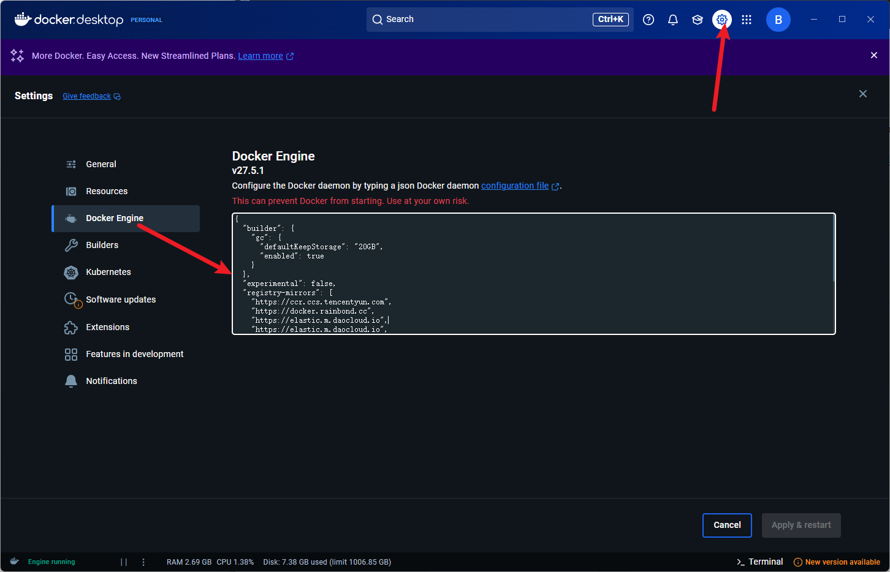

我采用的是官方提供的 Fastapi + React 全栈模板。官方 Readme 在根目录下的 `README-official.md`，可以参考。                                                                                                                                                                                                                                                                                                                                                                                                                                                                                                                                                                                                                                      

## 前置

- 需要安装 docker，windows 系统上安装 docker desktop 即可。

docker desktop 设置里面 Docker Engine 这里，添加国内镜像，配置改为：

```
{
  "builder": {
    "gc": {
      "defaultKeepStorage": "20GB",
      "enabled": true
    }
  },
  "experimental": false,
  "registry-mirrors": [
    "https://ccr.ccs.tencentyun.com",
    "https://docker.rainbond.cc",
    "https://elastic.m.daocloud.io",
    "https://elastic.m.daocloud.io",
    "https://docker.m.daocloud.io",
    "https://gcr.m.daocloud.io",
    "https://ghcr.m.daocloud.io",
    "https://k8s-gcr.m.daocloud.io",
    "https://k8s.m.daocloud.io",
    "https://mcr.m.daocloud.io",
    "https://nvcr.m.daocloud.io",
    "https://quay.m.daocloud.io"
  ]
}
```



然后点 `Apply & restart` 应用修改并且重启 docker。

- 修改根目录下的 `.env` 文件，我已经预先配置好了，其中，


建议暂且不要改数据库的密码，就用我提供的，如果要更改的话，需要删除之前创建的数据表的卷。


## 项目运行

```shell
docker-compose up -d
```

启动成功之后：

http://localhost:5173/ 为前端界面。

http://localhost:8080/ 为数据库管理界面

http://localhost:8000/docs 查看 api 文档

http://localhost:7474/browser/ 为 Neo4j 界面


查看日志，你可以另开一个 shell

```shell
docker compose logs
```


如果要关闭项目

```shell
docker-compose down
```


## 注意事项

- 前端代码但是重新启动应用并没有变化。

  - 需要重新构建。我在项目根目录的 scripts 文件中提供了 `rebuild-frontend.sh` 脚本，用于自动化重新构建。在根目录下使用:

    ```shell
    ./scripts/rebuild-frontend.sh
    ```

    
